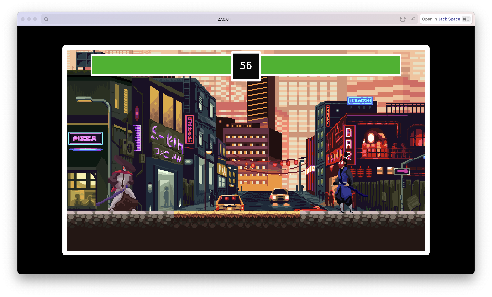

# Punk Battle Refine

A refined version of the Punk Battle game developed using the [Kaboom.js](https://kaboomjs.com/) JavaScript library. This project offers an updated take on the classic punk battle concept with enhanced gameplay mechanics and visuals.



---

## Table of Contents

- [Punk Battle Refine](#punk-battle-refine)
  - [Table of Contents](#table-of-contents)
  - [About the Project](#about-the-project)
  - [Features](#features)
  - [Built With](#built-with)
  - [Getting Started](#getting-started)
  - [Usage](#usage)
  - [Contributing](#contributing)
  - [License](#license)
  - [Contact](#contact)
  - [Acknowledgements](#acknowledgements)

---

## About the Project

**Punk Battle Refine** is an iteration of the original Punk Battle game aimed at delivering a more engaging and visually captivating experience. Built entirely in JavaScript using Kaboom.js, the game leverages modern web technologies to bring fast-paced, arcade-style action directly to your browser.

---

## Features

- **Refined Gameplay:** Enhanced game mechanics for a smoother and more dynamic player experience.
- **Stylish Visuals:** Updated graphics and animations that immerse players in a cyberpunk-inspired world.
- **Responsive Design:** Optimized for various screen sizes, ensuring accessibility on both desktop and mobile devices.
- **Easy-to-Run:** Straightforward installation and setup process, ready to play out-of-the-box.

---

## Built With

- [Kaboom.js](https://kaboomjs.com/) – A JavaScript game programming library.
- HTML/CSS/JavaScript – Core technologies used for building and styling the game.

---

## Getting Started

To run the game locally, follow these simple steps:

1. **Clone the Repository:**

   ```bash
   git clone https://github.com/JackSuuu/Punk-Battle-refine.git
   ```

2. **Navigate to the Project Directory:**

   ```bash
   cd Punk-Battle-refine
   ```

3. **Open the Game:**

   Simply open the `index.html` file in your web browser to start playing the game.

---

## Usage

Once you have the game open in your browser:

- Use the keyboard controls to navigate and battle.
- Explore the refined mechanics and enjoy smoother, more engaging gameplay.
- Check the in-game instructions (if any) for specific controls and objectives.

---

## Contributing

Contributions are welcome! If you have suggestions for improvements or have identified issues, please feel free to open an issue or submit a pull request.

1. Fork the repository.
2. Create your feature branch: `git checkout -b feature/YourFeature`
3. Commit your changes: `git commit -m 'Add some feature'`
4. Push to your branch: `git push origin feature/YourFeature`
5. Open a pull request.

---

## License

Distributed under the MIT License. See the [LICENSE](LICENSE) file for more details.

---

## Contact

For any questions or feedback, please reach out:

- **GitHub:** [JackSuuu](https://github.com/JackSuuu)
- **Repository:** [Punk Battle Refine](https://github.com/JackSuuu/Punk-Battle-refine)

---

## Acknowledgements

- [Kaboom.js](https://kaboomjs.com/) for providing an excellent framework for game development.
- Inspirations from the cyberpunk aesthetic and previous game iterations that paved the way for this refined version.